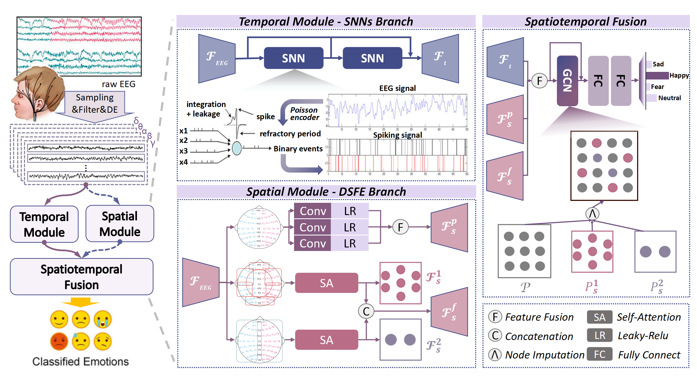

# ST-SNN-DSFE: A Spatio-Temporal Hybrid Network for EEG-based Emotion Recognition

**Abstract**: Emotion recognition based on electroencephalogram (EEG) signals has significant potential for applications in mental health and human-computer interaction. However, existing methods often fail to fully exploit the intricate temporal dynamics and spatial dependencies inherent in EEG data. To address these challenges, we propose ST-SNN-DSFE, a novel framework that integrates temporal and spatial feature extraction to improve recognition performance. From the temporal perspective, Spiking Neural Networks (SNNs) are employed to capture fine-grained temporal dynamics, leveraging their biological plausibility and efficiency in processing temporal spikes. Additionally, the inherent characteristics of SNNs provide a slight denoising effect, which is advantageous for handling the noisy nature of EEG signals and enhancing the robustness of temporal feature extraction. From the spatial perspective, multi-scale convolutions are utilized to extract global physical information and positional encodings from EEG signals comprehensively, while prior knowledge is incorporated to define two distinct subgraph partitioning strategies based on brain regions and hemispherical divisions to extract local functional information and functional virtual positional encodings, enabling robust modeling of functional connectivity. Finally, Graph Convolutional Networks (GCNs) are employed to fuse the temporal and spatial features by integrating feature embeddings and positional relationships, improving emotion recognition performance. Extensive experiments on two benchmark datasets (SEED and SEED-IV) demonstrate the effectiveness of the proposed method, achieving state-of-the-art performance in both subject-dependent and subject-independent scenarios.

**Dataset**: [SEED – SJTU Emotion EEG Dataset](https://bcmi.sjtu.edu.cn/home/seed/index.html)




1. **Download Dataset**  
   Download SEED dataset from:  
   https://bcmi.sjtu.edu.cn/home/seed/index.html  

2. **Set Up Environment**

   ```bash
   conda create -n seed python=3.9 -y
   conda activate seed
   pip install -r requirements.txt
   ```

3. **Run the main file. (train + auto test)**

   ```bash
   python main_ST.py
   ```


